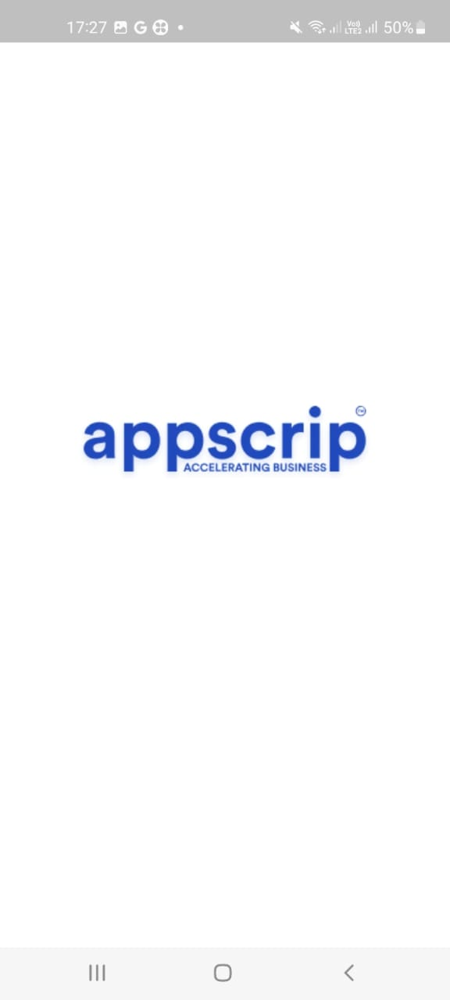
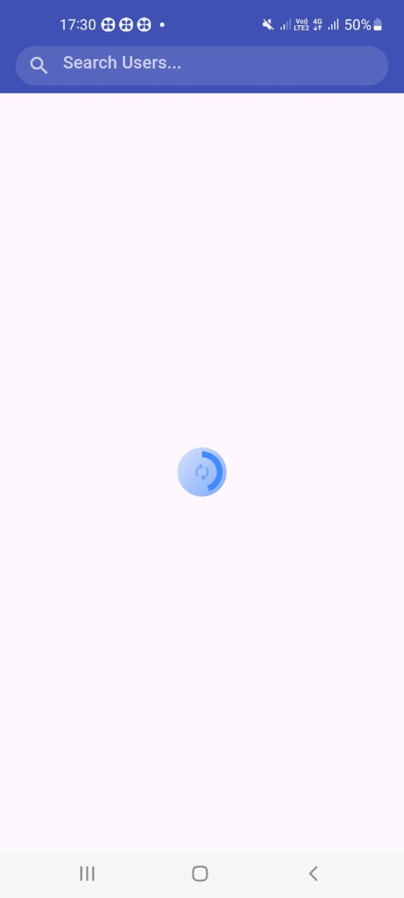
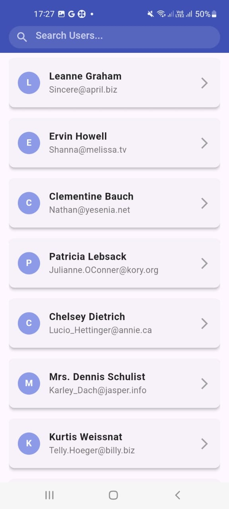
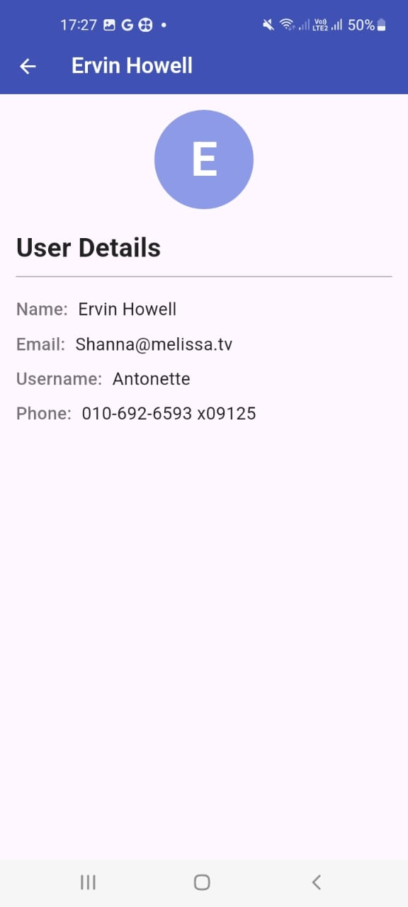
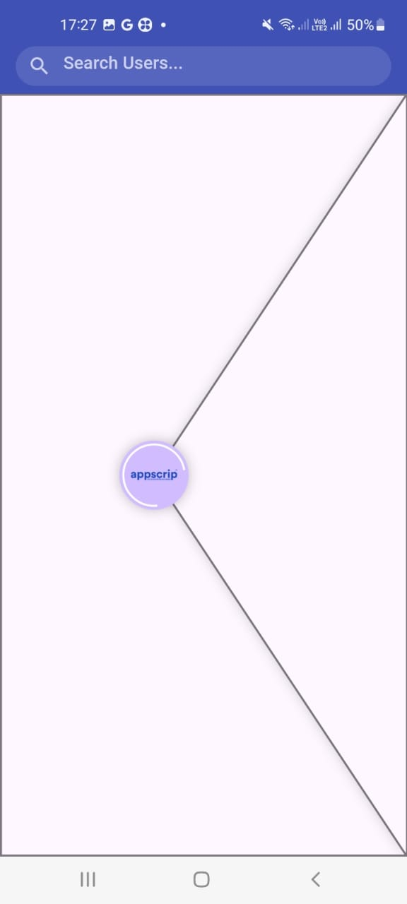

# Appscrip-User-List-Flutter-App

## Description
**Appscrip-User-List-Flutter-App** is a simple Flutter application designed to fetch and display user data from a public API. This app presents a clean and visually appealing user interface that lists user names and email addresses. 

## Features
- Fetches user data from [JSONPlaceholder API](https://jsonplaceholder.typicode.com/users).
- Displays a list of users with their names and email addresses.
- Shows a loading indicator while fetching data.
- Implements pull-to-refresh functionality to refresh the user list.
- Provides error handling for failed API requests.
- Includes search functionality to filter users by name.
- Features a user detail screen that displays more information about each user when tapped.

## Instructions to Run the App
### Prerequisites
- **Flutter SDK**: Ensure you have the latest stable version of Flutter installed on your system. Follow the instructions on the [official Flutter installation page](https://flutter.dev/docs/get-started/install) if you need help.
- **Dart SDK**: Dart is bundled with the Flutter SDK, so no separate installation is required.

### Installation
1. **Clone the repository**: 
   git clone https://github.com/Raju8055/Appscrip-User-List-Flutter-App.git
   cd appscrip-user-list-flutter-app
   

2. **Install the dependencies**: 
   flutter pub get
   

3. **Run the application**: 
   flutter run
   

4. **Open the app**: The app will launch on your connected device or emulator, displaying the splash screen, followed by the user list.

## Assumptions and Decisions
- **State Management**: Utilized the Bloc pattern for effective state management to ensure smooth UI updates during data fetching and user interaction.
- **Custom Widgets**: Created custom widgets (like `custom_circular_loader` and `custom_refresh_indicator`) to improve code organization and maintainability.
- **Error Handling**: Implemented comprehensive error handling to enhance user experience. Users are informed about any issues during data fetching with appropriate messages.
- **User Experience**: Designed with a focus on usability, ensuring intuitive navigation and interactions throughout the app.

## Screenshots
 *Splash Screen displaying app logo and loading indication*  
  
  *User List Screen showcasing user names and email addresses*  
 *User Detail Screen showing additional user information* 
  

